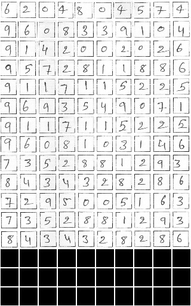

# Smartforms #
Paper Link- <a href = "https://www.cse.iitd.ernet.in/~aseth/smartforms.pdf">Smartforms</a>

## Abstract ##
Initiation, monitoring, and evaluation of development programmes
can involve field-based data collection about project activities. This
data collection through digital devices may not always be feasible
though, for reasons such as unaffordability of smartphones and
tablets by field-based cadre, or shortfalls in their training and capacity building. Paper-based data collection has been argued to be
more appropriate in several contexts, with automated digitization of
the paper forms through OCR (Optical Character Recognition) and
OMR (Optical Mark Recognition) techniques. We contribute with
providing a large dataset of handwritten digits, and deep learning
based models and methods built using this data, that are effective in
real-world environments. We demonstrate the deployment of these
tools in the context of a maternal and child health and nutrition
awareness project, which uses IVR (Interactive Voice Response)
systems to provide awareness information to rural women SHG
(Self Help Group) members in north India. Paper forms were used
to collect phone numbers of the SHG members at scale, which were
digitized using the OCR tools developed by us, and used to push
almost 4 million phone calls. 

</br></br>
## Updates- ##
Handwritten Digit Dataset - ✅ </br>
Code and pretrained models - ✅ </br>
Library for designing new forms - ❌ (coming soon!) </br>
End-to-end Code for homography based roi extraction and recognition - ❌ (coming soon!)  </br>


<p align="center">

<figcaption><b>Fig.1 - OCR Pipeline</b></figcaption>
</p>


## Requirements ##
1. python >= 3.0
2. tensorflow >= 2.0
3. tensorflow-addons
4. numpy==1.19.5
5. pandas == 1.4.2 
6. PIL
7. OpenCV

## Dataset Description ##
The dataset consists of a grid of 16X10 cells, in which each cell contains a handwritten digit of size 32X32. The size of the digit image is 30X30. There is a white(255) boundary of 1 pixel around the digit. A cell can be empty if there is no digit. 

<p align="center">

<figcaption><b>Fig.2 - Single Digit Dataset</b></figcaption>
</p>
</br></br>
Download the datasets from here- <a href="https://drive.google.com/drive/folders/1irPCLtfAuQLi_5PzHjhyXBjamliHmwAa?usp=sharing" target="_blank">Gdrive</a>

## Running the code ##
Clone the repository using the command-
```
git clone https://github.com/Smartforms2022/Smartforms.git
```
Download the dataset from the above link and put all the files in the data folder.
```
cd Single_Digit_Recognition
```
### Training ###
Train the model by running the train.sh file. This file specifies the location of the image folder, the ground truth file, the train/val/test split file, and the directory to which the weights should be saved. You may modify the paths in this file as necessary. If None is specified for the train/val/test split file, the code will generate a new split.
```
python ./code/train_embedding.py \
       --image_folder_path=./data/form2 \
       --output_path=./weights/form2 \
       --ground_truth_path=./data/form2_gt.txt \
       --split_path=./data/form2_split3.pkl
       
python ./code/train_classifier.py \
       --image_folder_path=./data/form2 \
       --output_path=./weights/form2 \
       --ground_truth_path=./data/form2_gt.txt \
       --split_path=./data/form2_split3.pkl \
       --weight_path=./weights/form2/embedding.h5
```


### Testing ###
Run the test.sh file to validate the model, weights for the trained models are included in the Weights folder. You may modify the paths in this file as necessary.
```
python ./code/test.py \
       --image_folder_path=./data/form2 \
       --weight_path=./weights/form2/classifier1.h5 \
       --ground_truth_path=./data/form2_gt.txt \
       --split_path=./data/form2_split3.pkl
```

## Visualization ##
Following are the 2D UMAP visualizations of the embedding obtained from the Softmax and Triplet loss based model-
<p align="center">
  
&nbsp;&nbsp;&nbsp;&nbsp;&nbsp;&nbsp;&nbsp;                     
  
  <figcaption><b>Fig.3 - 2D Visualization of Embeddings</b></figcaption>
</p>
